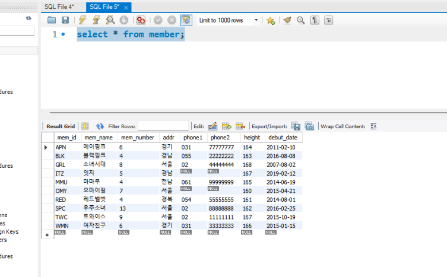
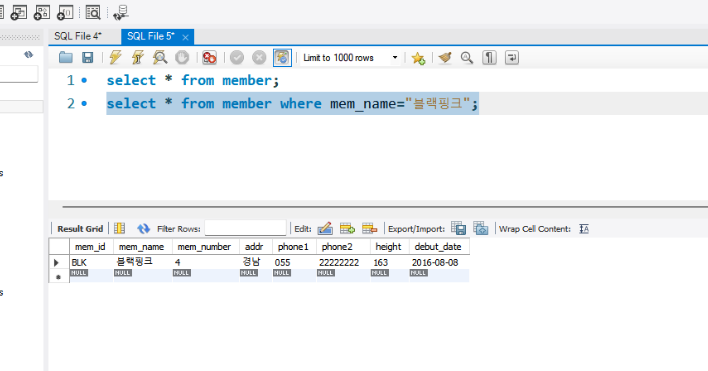
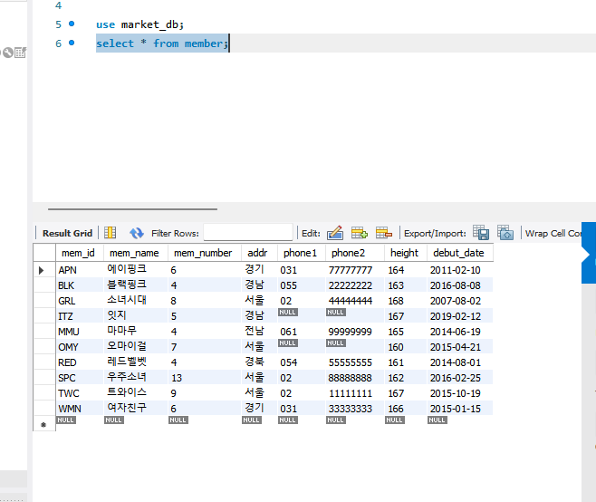
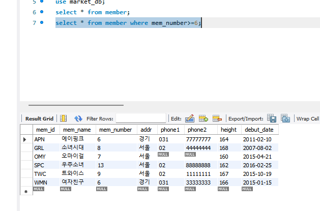
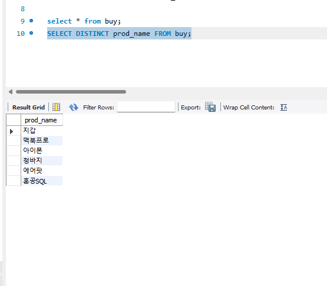
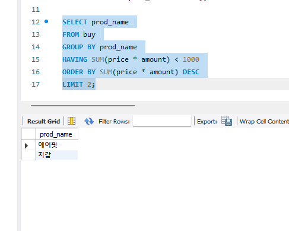

# SQL_ADVANCED 2주차 정규 과제 

📌SQL_ADVANCED 정규과제는 매주 정해진 분량의 『*혼자 공부하는 SQL*』 을 읽고 학습하는 것입니다. 이번주는 아래의 **SQL_ADVANCED_2nd_TIL**에 나열된 분량을 읽고 공부하시면 됩니다.

아래의 문제를 풀어보며 학습 내용을 점검하세요. 문제를 해결하는 과정에서 개념을 스스로 정리하고, 필요한 경우 제시된 강의를 참고하여 보완하는 것이 좋습니다.

<!-- 강의 링크는 아래와 같습니다.
https://www.youtube.com/watch?v=_JURyg_KzHE&list=PLVsNizTWUw7GCfy5RH27cQL5MeKYnl8Pm&index=7
https://www.youtube.com/watch?v=6qkPy7RfLqQ&list=PLVsNizTWUw7GCfy5RH27cQL5MeKYnl8Pm&index=8
https://www.youtube.com/watch?v=WWAFAm9op2U&list=PLVsNizTWUw7GCfy5RH27cQL5MeKYnl8Pm&index=9
-->

**교재 실습 예제 파일은 08_SQL_ADVANCED_Template 레포지토리의 src 폴더에 업로드되어 있습니다. market_db 파일도 해당 폴더에 함께 포함되어 있으니 참고하시기 바랍니다.**

**👀(수행 인증샷은 필수입니다.)** 

## SQL_ADVANCED_2nd_TIL

### 3장 SQL 기본 문법
#### 01. 기본 중에 기본 SELECT ~ FROM ~ WHERE
#### 02. 좀 더 깊게 알아보는 SELECT문
#### 03. 데이터 변경을 위한 SQL문


## Study Schedule

| 주차  | 공부 범위     | 완료 여부 |
| ----- | ------------- | --------- |
| 1주차 | p.24~99    | ✅         |
| 2주차 | p.102~155   | ✅         |
| 3주차 | p.158~213  | 🍽️         |
| 4주차 | p.216~271 | 🍽️         |
| 5주차 | p.274~327 | 🍽️         |
| 6주차 | p.330~369 | 🍽️         |
| 7주차 | p.372~407 | 🍽️         |


<br>

<!-- 여기까진 그대로 둬 주세요-->

---

# 1️⃣ 학습 내용 정리

## 1. 기본 중에 기본 SELECT ~ FROM ~ WHERE

<!-- 기본적인 SQL 문법에 관해 배우게 된 점을 적어주세요. -->
1. SELECT 문과 WHERE 절
SELECT는 이미 구축된 테이블에서 원하는 데이터를 검색하고 불러올 때 사용하는 가장 핵심적인 명령어이다. 기본 구조는 'SELECT 컬럼명 FROM 테이블명 WHERE 조건식'으로 이루어진다. 여기서 WHERE 절을 활용하면 전체 데이터가 아닌, 특정 조건에 부합하는 데이터만 정밀하게 필터링해서 추출할 수 있다.

2. USE 문
서버에 존재하는 여러 개의 데이터베이스 중, 지금부터 어떤 데이터베이스를 열어서 작업할지 지정하고 활성화하는 명령어이다.

3. DROP DATABASE 문
기존에 만들어둔 데이터베이스를 통째로 삭제하는 명령어이다. 이 명령어를 실행하면 내부의 모든 테이블과 데이터가 영구적으로 날아가므로 주의해서 사용해야 한다.

4. INSERT 문
미리 뼈대를 만들어 둔 테이블 안에 새로운 데이터(행, Record)를 실제로 채워 넣을 때 사용하는 데이터 입력 명령어이다.

<!-- 과제 페이지를 참조하여 인증 사진 2장을 아래의 부분을 지우고 제출해주세요. -->




> **확인문제: 주소의 지역이 서울, 경기인 회원을 추출하는 SQL 문입니다. 빈칸에 들어갈 수 있는 것을 모두 고르세요.**

```sql
SELECT *
FROM table
WHERE ________;
```

보기는 아래와 같습니다.
```
1. addr IN('서울', '경기')
2. addr BETWEEN '서울' AND '경기'
3. addr = '서울' OR addr = '경기'
4. addr = '서울' AND addr = '경기'
```

```
정답은 1번, 3번이다.

주소 지역이 서울이거나 경기인 회원을 찾는 것이므로, 둘 중 하나의 조건만 만족해도 데이터가 추출되는 논리합(OR) 연산이 필요하다. 1번의 IN 연산자는 괄호 안에 나열된 값 중 하나라도 일치하면 참이 되므로 목적에 부합하는 올바른 식이다. 3번 역시 OR 연산자를 사용하여 주소가 서울인 경우와 경기인 경우를 각각 명확하게 연결했으므로 정답이다. 

반면 2번의 BETWEEN 연산자는 특정 값들의 연속적인 범위를 지정할 때 사용하므로 해당 문제에는 적절하지 않다. 4번의 AND 연산자는 하나의 주소 값이 동시에 서울이면서 경기일 수는 없기 때문에 어떤 데이터도 추출되지 않는 잘못된 식이다.
```


## 2. 좀 더 깊게 알아보는 SELECT문

<!-- ORDER BY절과 GROUP BY절 그리고 HAVING절에 관해 배우게 된 점을 적어주세요. -->

```
ORDER BY절: ORDER BY는 조회된 데이터를 정렬할 때 사용하며, 기본값인 오름차순(ASC) 외에 내림차순 정렬이 필요하면 DESC를 명시해야 한다. 쉼표(,)로 여러 컬럼을 연결해 1차, 2차 정렬 기준을 세밀하게 지정할 수 있고, LIMIT과 결합해 상위 N개의 데이터만 추출하는 것도 가능하다. 단, 문법 구조상 반드시 WHERE 절 뒤에 작성해야 에러가 나지 않는다.
GROUP BY절: GROUP BY는 특정 기준에 따라 데이터를 묶어주는 역할을 하며, 주로 SUM, AVG, COUNT 등의 집계 함수와 짝을 이루어 활용된다. 여기서 COUNT(컬럼명)은 NULL(빈칸) 값을 제외한 실제 데이터의 개수만 세지만, COUNT(*)는 NULL을 포함한 전체 테이블의 행 개수를 통째로 센다는 중요한 차이점이 있다.
HAVING절: GROUP BY로 묶어낸 결과 그룹에 조건을 걸어 필터링할 때는 WHERE가 아닌 HAVING 절을 반드시 사용해야 한다. WHERE 절은 데이터를 묶기 전에 개별 행을 필터링하는 반면, HAVING 절은 그룹화가 모두 끝난 이후에 작동하므로 조건식 안에 집계 함수(예: SUM(매출) > 1000)를 직접 사용할 수 있다는 것이 가장 큰 특징이다.
```

> **확인문제: 다음 표는 주요 집계함수를 정리한 것입니다. 각 설명에 해당하는 올바른 함수명을 기호에 맞게 작성하세요.**

| 함수명 | 설명 |
|--------|------|
| SUM() | 합계를 구합니다. |
| (ㄱ) | 평균을 구합니다. |
| (ㄴ) | 최소값을 구합니다. |
| MAX() | 최대값을 구합니다. |
| (ㄷ) | 행의 개수를 셉니다. |
| (ㄹ) | 행의 개수를 셉니다 (중복은 1개만 인정). |

```
여기에 답을 적어주세요!
(ㄱ) AVG()
(ㄴ) MIN()
(ㄷ) COUNT()
(ㄹ) COUNT(DISTINCT 컬럼명)
```


## 3. 데이터 변경을 위한 SQL문

<!-- INSERT문, UPDATE문, DELETE문에 관해 배우게 된 점을 적어주세요. -->

```
INSERT문: 테이블에 새로운 데이터를 행 단위로 추가할 때 사용하는 명령어이다. 지정한 열의 개수와 입력할 데이터 값의 개수 및 형식이 정확히 일치해야 하는 것이 기본 원칙이다. 단, 테이블의 모든 열에 빠짐없이 값을 넣을 때는 열 이름 지정을 생략할 수 있어 매우 편리한 기능이다.
UPDATE문: 기존에 입력된 데이터를 수정할 때 사용하며, SET 절을 이용해 변경할 값을 지정하는 구조이다. 이때 특정 조건을 걸어주는 WHERE 절을 생략하면 테이블 내의 모든 행이 한꺼번에 수정되는 치명적인 실수가 발생할 수 있으므로 각별한 주의가 필수적이다.
DELETE문: 테이블의 데이터를 행 단위로 삭제하며, WHERE 절을 통해 원하는 조건의 데이터만 골라서 지우는 것이 가능한 명령어이다. 전체 데이터를 한 번에 비우는 TRUNCATE 명령어와 달리 데이터를 하나씩 순차적으로 지우기 때문에 대용량 데이터를 다룰 때는 처리 속도가 상대적으로 느리다는 것이 특징이다.
```


# 2️⃣ 실습과제

다음 SQL 문을 작성하고 실행 결과를 확인 후 인증 사진을 아래에 업로드하세요.(market_db를 그대로 사용합니다.)

1. 모든 그룹 멤버의 정보를 조회하시오.
2. 멤버의 수가 6명 이상인 그룹 정보를 조회하시오.
3. 현재 구매 테이블에 존재하는 서로 다른 상품(prod_name)이 어떤 것이 있는지 조회하시오.
4. 총 구매 금액이 1000미만인 prod_name 중 상위 2개만 조회하시오.






### 🎉 수고하셨습니다.


